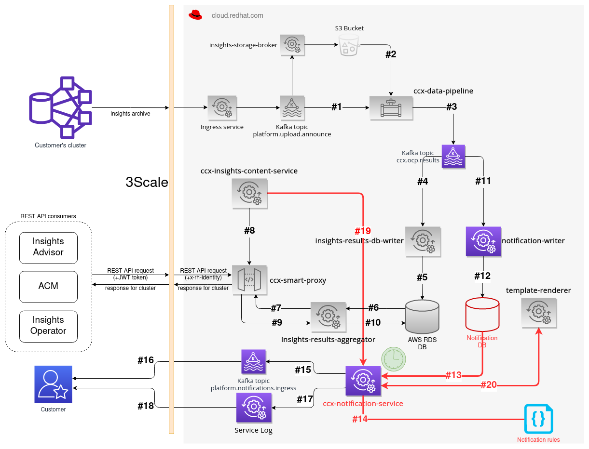
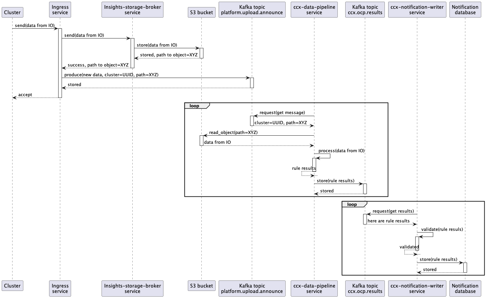

# Description

The main task for this service is to listen to configured Kafka topic, consume
all messages from such topic, and write OCP results (in JSON format) with
additional information (like organization ID, cluster name, Kafka offset etc.)
into database table named `new_reports`. Multiple reports can be consumed and
written into the database for the same cluster, because the primary (compound)
key for `new_reports` table is set to the combination `(org_id, cluster,
updated_at)`. When some message does not conform to expected schema (for
example if `org_id` is missing), such message is dropped and the error is
stored into log.

Additionally this service exposes several metrics about consumed and processed
messages. These metrics can be aggregated by Prometheus and displayed by
Grafana tools.

## Architecture

[Architecture diagram, full scale](images/architecture_diagram.png)

## Data flow

The "end-to-end" data flow is described there (including Notification Writer service part):

1. A customer cluster with *Insights Operator* installed sends new data containing info about the cluster into *Ingress service*
1. The *Ingress service* consumes the data, writes them into an S3 Bucket, and produces a new message into a Kafka topic named `platform.upload.buckit`.
1. The *CCX Data pipeline* service consumes the message from the `platform.upload.buckit` Kafka topic.
1. That message represents an event that contains (among other things) an URL to S3 Bucket.
1. Insights operator data is read from S3 Bucket and *insights rules* are applied to that data in `ccx-data-pipeline` service.
1. Results (basically `organization ID` + `cluster name` + `insights results JSON`) are stored back into Kafka, but into different topic named `ccx.ocp.results`.
1. That results are consumed by `ccx-notification-writer` service.
1. `ccx-notification-writer` service stores insights results into AWS RDS database into `new_reports` table.
1. Content of that table is consumed by `ccx-notification-service` periodically.
1. Newest results from `new_reports` table is compared with results stored in `reported` table.
1. If changes (new issues) has been found, notification message is sent into Kafka topic named `platform.notifications.ingress`.
1. The newest result is stored into `reported` table to be used in the next `ccx-notification-service` iteration.

### Remarks

1. Steps 1 to  5 are shared with the CCX Data pipeline
1. Steps 7 and 8 are performed by `ccx-notification-writer` service.
1. Steps 9 to 12 are performed by `ccx-notification-service` service.

## Class diagram

[Class diagram, full scale](images/class_diagram.png)

## Sequence diagram

[Sequence diagram, full scale](images/sequence_diagram.png)

## Database description

* PostgreSQL database is used as a storage.
* Database description is available [here](./db-description/index.html)

## Documentation for source files from this repository

* [ccx_notification_writer.go](./packages/ccx_notification_writer.html)
* [config.go](./packages/config.html)
* [constants.go](./packages/constants.html)
* [consumer.go](./packages/consumer.html)
* [logging.go](./packages/logging.html)
* [metrics.go](./packages/metrics.html)
* [storage.go](./packages/storage.html)
* [types.go](./packages/types.html)

## Documentation for unit tests files for this repository

* [ccx_notification_writer_test.go](./packages/ccx_notification_writer_test.html)
* [config_test.go](./packages/config_test.html)
* [constants_test.go](./packages/constants_test.html)
* [consumer_test.go](./packages/consumer_test.html)
* [logging_test.go](./packages/logging_test.html)
* [metrics_test.go](./packages/metrics_test.html)
* [storage_test.go](./packages/storage_test.html)
* [export_test.go](./packages/export_test.html)
